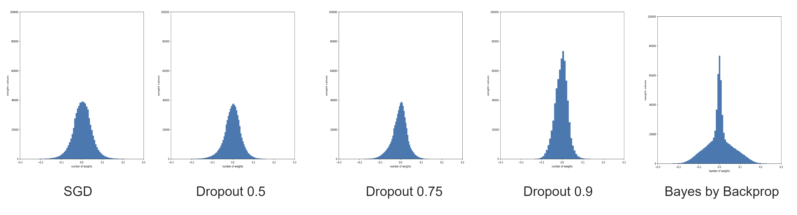
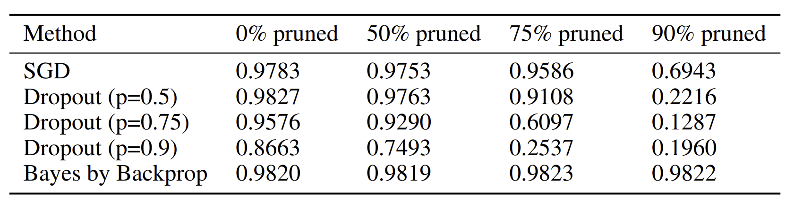
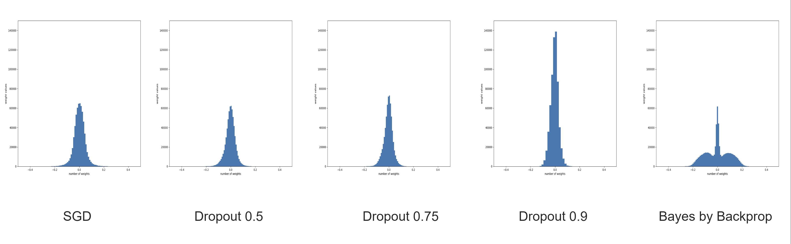
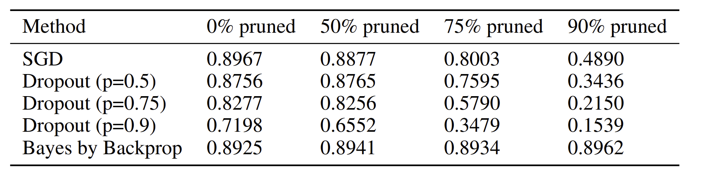

# Weight pruning and Uncertainty in Neural Networks

This reposity has notebooks which has the reproduced Bayesian Neural Networks [1]. [1] proposed a 
Bayeisan Neural Network framework which achieves great accuracy results when compared to normal 
SGD-based approaches. Apart from predicting the uncertainty, which is the primary reason for which 
authors had introduced their approach, they also claim that their network achieves great accuracy 
even after pruning 90% of the weights. Such an impressive result motivates us to dive deep into the 
approach and know its true efficacy by truly comparing it with other baseline methods. 

In this project, we do a systematic analysis of the Bayes by Backprop method for model compression 
by reproducing it with several other baseline methods like vanilla stochastic gradient descent (SGD)
and Dropout based SGD under the same training and testing environment. Our results show that Bayes 
by Backprop indeed outperforms all other methods by a huge margin. However, it pays a really heavy
computational cost in terms of wall time but needs fewer epochs to fit the data. 

For more information you can refer to the project report called PML_Project_Final_Report.pdf present
in the main folder of this repository.

## Results

The figures below show the weight distribution of all 5 models trained on the MNIST dataset for
50 epochs

 

The Table below presents the weight distribution of all 5 models trained on the MNIST dataset for
50 epochs

The figures below show the weight distribution of all 5 models trained on the FMNIST dataset for
50 epochs

 

The Table below presents the weight distribution of all 5 models trained on the FMNIST dataset for
50 epochs

## Discussion and Conclusion

As seen in the tables the dropout and SGD-based methods do not attain as good as Bayes by Backprop
performance at any stage (before and after pruning). However, we can see that in terms of weight
distribution variance SGD models show us a little more variance than dropout models. And that is
why we can also see that after pruning, the SGD-based models perform a little better performance
than the dropout models. This shows that the authors [1] argue that having a larger variance in model
parameters distribution indeed helps to retain performance after pruning.

By looking at these results and training curves we can conclude that all models are underfitting if we
keep training them for more epochs all of them will continue to improve. And because of this we
also tried to train SGD and Dropout based networks for more than 50 epochs and trained the models
to 150 epochs. We did see a minor improvement in the dropout models distribution variance and
resulting accuracy gain. But it was not a major improvement and the models were still underfitting.

For this reason, we do not show the results for the 150 epochs experiments as it will be redundant.
Thus, in future work, we plan to train the models for much more long. The authors [1] have trained
a much larger network with 1200 hidden units and for 600 epochs and this also suggests that our
models are underfitting.

But from our work, we can conclude one interesting property of the [1] Bayesian Neural Network is
that it gets trained more quickly in terms of the number of epochs when compared with SGD and
Dropout based models.

For more information you can refer to the project report called PML_Project_Final_Report.pdf present
in the main folder of this repository.

## References 

[1] C. Blundell, J. Cornebise, K. Kavukcuoglu, and D. Wierstra. Weight uncertainty in neural
networks, 2015. URL https://arxiv.org/abs/1505.05424.

[2] https://www.nitarshan.com/bayes-by-backprop/